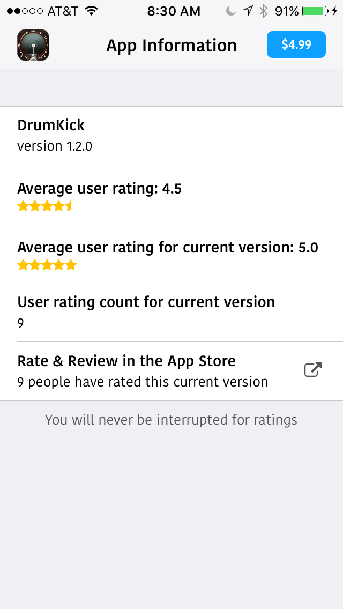

# Ratings

This Swift Xcode project demonstrates how to show your app ratings with Font Awesome icons, using the [iTunes Search API](https://affiliate.itunes.apple.com/resources/documentation/itunes-store-web-service-search-api/#lookup). 



### Features & Specifications:

* The API call to the [iTunes Search API](https://affiliate.itunes.apple.com/resources/documentation/itunes-store-web-service-search-api/#lookup) was requested with NSURLSession, and the JSON was parsed using NSJSONSerialization.
* Displays how many users have rated and reviewed the current version of the app, using icons from **[Font Awesome](http://fontawesome.io/)**.
* Provides options to add your Apple affiliate token, a campaign token, and a provider token for iTunes Connect tracking and obtaining 7% commission for app purchase that is made from your affiliate App Store link (within a 24-hour period).
* Contains a low-level network connection detector. If the JSON results count == 0, then the app will alert the user, and attempt to access the iTunes Search API to activate an auto-refresh and display the content when a connecion is established. The timer expires after nothing is found within 60 seconds.
* Optimized for all devices, orientation, split screen and slide-over multitasking (iOS 9+ iPad Air 2 and iPad Pro only).
* Minimum requirements: iOS 8
* Authored with Xcode 7.3.1 and Swift 2.

This example uses the `trackId` (589674071) for my app, [DrumKick](https://itunes.apple.com/us/app/drumkick/id589674071?pt=259432&mt=8&uo=4&at=10l3KX&ct=github-ratings-drumkick), to show this API call in action. In iTunes Connect, the track ID is the same as the Apple ID.

## Installation into Your Own Xcode Project

### ApiManager.swift

This is a sharedInstance singleton class that contains the API call to the iTunes Search API. It makes the task request with NSURLSession, and the JSON was parsed using NSJSONSerialization. Global Central Dispatch places the request on a separate thread, and updates the UI via NSNotification when the JSON data has been successfully received.

You can simply drag and drop this ApiManager.swift file into your own project.

For the ApiManager to work from the ViewController of your choice, you must include the following:

1. Add a trackId variable and include your app's trackId number, such as: "589674071". This is *mandatory* so that the iTunes Search API can look up and return the desired JSON results. `var trackId:String = "589674071"`
2. `NSNotificationCenter.defaultCenter().addObserver(self, selector: #selector(dataReceived), name: "refreshContent", object: nil)` within the viewDidLoad method.
2. `requestData(trackId:String)` method to initiate the JSON request, such as: `ApiManager.sharedInstance.getApiRequest(trackId)` 
2. `requestData(trackId)` from within the `viewDidLoad` method.
3. `dataReceived()` method which gets triggered via the `refreshContent` NSNotification.
4. `parseResultsData()` method which inserts the JSON results into their appropriate variable strings, i.e., `trackName`, `averageUserRatingForCurrentVersion`, etc.
### Track ID – required

### How to Find Your App's `trackId` Number

Here are a few ways:

1. Log into your iTunes Connect develope account at [https://itunesconnect.apple.com](https://itunesconnect.apple.com). Click on your app within "My Apps," and find the Apple ID number within "App Information."
2. Do a web search for your app's name, such as "drumkick itunes." Within the page results, click on the iTunes link that showcases your app, then copy the number that follows `id` in the iTunes URL, such as [https://itunes.apple.com/us/app/drumkick/id589674071?mt=8](https://itunes.apple.com/us/app/drumkick/id589674071?mt=8). From the URL, I'm grabbing **589674071** after the **id**.
3. Open the iTunes Mac app. Search for your app's name. Then, on the app's purchase or download button, click on the right-side contextual menu and select the "Copy link" option. Paste the copied link into a text-editor and grab the number that follows `id` in the iTunes URL.    

Enter your app's ID number into the `trackId` string variable. This will be passed into the `ApiManager.swift` singleton to identify the app ["lookup"](https://affiliate.itunes.apple.com/resources/documentation/itunes-store-web-service-search-api/#lookup) when requesting data from the iTunes Search API. 

````swift
// Enter the track ID (AKA: Apple ID) from iTunes
var trackId = "589674071"
````

For a list of all of the app [attributes](https://affiliate.itunes.apple.com/resources/documentation/itunes-store-web-service-search-api/#understand) that are returned in JSON format, please check out the [iTunes Search API](https://affiliate.itunes.apple.com/resources/documentation/itunes-store-web-service-search-api/) page.

### App Transport Security Settings
In order to download and display the app's icon in your app, you must add `App Transport Security Settings` within your projects `Info.plist`. 
1. Open its row to add `Allow Arbitrary Loads` as the dictionary key.
2. Set its boolean value to `YES`. 

If you don't add this for iOS 9 users, they won't be able to display the app image icon from the API string as NSURL data. It will appear blank.


### Font Awesome Icons

The star rating and the external link icons are displayed using the free **Font Awesome** font. Here is how to integrate them into your own Xcode project:

1. Download the Font Awesome font from [http://fontawesome.io/](http://fontawesome.io/).
2. Open the downloaded zip file and select `fontawesome-webfont.ttf` from within the `fonts` folder. If you want to use the Font Awesome icons in your Mac authoring app, such as Adobe Photoshop or Illustrator, 
3. Drag and drop to import and copy the True-Type font into your Xcode project navigation tree.
4. Open the `Info.plist` and add the property: `Fonts provided by application`
5. Inside of `Item 0`, enter `fontawesome-webfont.ttf` as the string value.
6. For the following example, create a new UILabel called accessoryViewIcon.

````swift
// Within the ViewController's class:

let accessoryViewIcon = UILabel(frame: CGRectMake(0.0, 0.0, 20.0, 20.0))

// Within the viewDidLoad method:

accessoryViewIcon.textColor = UIColor(red: 150/255, green: 150/255, blue: 150/255, alpha: 1.0) // <-- Gray color
accessoryViewIcon.font = UIFont(name: "FontAwesome", size: 16)
accessoryViewIcon.text = "\u{f08e}"

// Within the 'cellForRowAtIndexPath' TableView method:

// Insert the accessoryViewIcon into the accessoryView for the specific cell.
cell.accessoryView = accessoryViewIcon
````

The unicode for the accessoryViewIcon is: fa-external-link [&#xf08e;], so all you need to grab is the `f08e` portion of the unicode. The string will end up looking like this: `"\u{f08e}"`

The unicode numbers for each icon can be found here: [http://fontawesome.io/cheatsheet](http://fontawesome.io/cheatsheet/)

If you use the Font Awesome icon font in your app, be sure to include Font Awesome attribution and license information, which can be found [here](http://fontawesome.io/license/).

## Optional Extras

### Product Token – optional
This token is provided within iTunes Connect, under App Analytics. It allows Apple to provide tapped area statistics within your app in the iTunes Connect App Analytics dashboard. That way, you can avoid using a third-party analytic SDK, such as Google Analytics, or Flurry. Requires apps targeted for iOS 8 and above.

````swift
// Enter your app's provider token
var providerToken:String? = "259432"
// This will append '&pt=259432' to your App Store product and review links. 
// If the optional string is nil, then nothing will be appended.
````

### Affiliate Token – optional
Enter your Apple affiliate token, so that you can earn 7% commission of each sale that is made via your link to the App Store. If you haven't joined the free affiliate program, I suggest you do that [now](http://www.apple.com/itunes/affiliates/)! Otherwise, that's potential, passive income that you're leaving on the table.

````swift
// Enter your Apple affiliate token:
var affiliateToken:String? = "10l3KX"
// This will append 'at=10l3KX' to your App Store product and review links. 
// If the optional string is nil, then nothing will be appended.
````

### Campaign Token – optional
The campaign token will provide information about where the App Store link was actually tapped/clicked. You can be as granular as you'd like. 

````swift
// Enter your campaign token:
var campaignToken:String? = "ratings-drumkick"
// This will append '&ct=ratings-drumkick' to your App Store product and review links.
// If the optional string is nil, then nothing will be appended.
````

Most people who have an Apple affiliate tokens don't seem to include campaign tokens, or know about them. But, it will help you identify where your App Store affiliate links are being triggered, and which apps are generating interest. In my example of 'ratings-drumkick', I'm listing [the app that contains the affiliate link]-[the name of the app that the App Store link is taking the user to].

### Product Link to your app's purchase page

````swift
// Product link on the App Store (AKA: 'trackViewUrl')
var appStoreProductLink:String?
// This will be populated by the iTunes Search API JSON results.
// It will look like this: https://itunes.apple.com/us/app/drumkick/id589674071?mt=8
````

### Direct Link to your app's review section

````swift
// Review and rating link on the App Store
var appStoreReviewLink:String? = "http://itunes.apple.com/WebObjects/MZStore.woa/wa/viewContentsUserReviews?pageNumber=0&sortOrdering=2&type=Purple+Software&mt=8"
````

This review link will *not* go anywhere on the App Store until your app's ID is appended to the end.

````swift
self.appStoreReviewLink! += "&id=\(self.trackId!)"
````

If your Product, Affiliate, and Campaign tokens are included (not nil), they will be appended to the `appStoreProductLink` and the `appStoreReviewLink` URLs. Here's their output:

**self.appStoreProductLink:** https://itunes.apple.com/us/app/drumkick/id589674071?mt=8&uo=4&pt=259432&at=10l3KX&ct=ratings-drumkick

**self.appStoreReviewLink:** http://itunes.apple.com/WebObjects/MZStore.woa/wa/viewContentsUserReviews?pageNumber=0&sortOrdering=2&type=Purple+Software&mt=8&id=589674071&pt=259432&at=10l3KX&ct=ratings-drumkick

